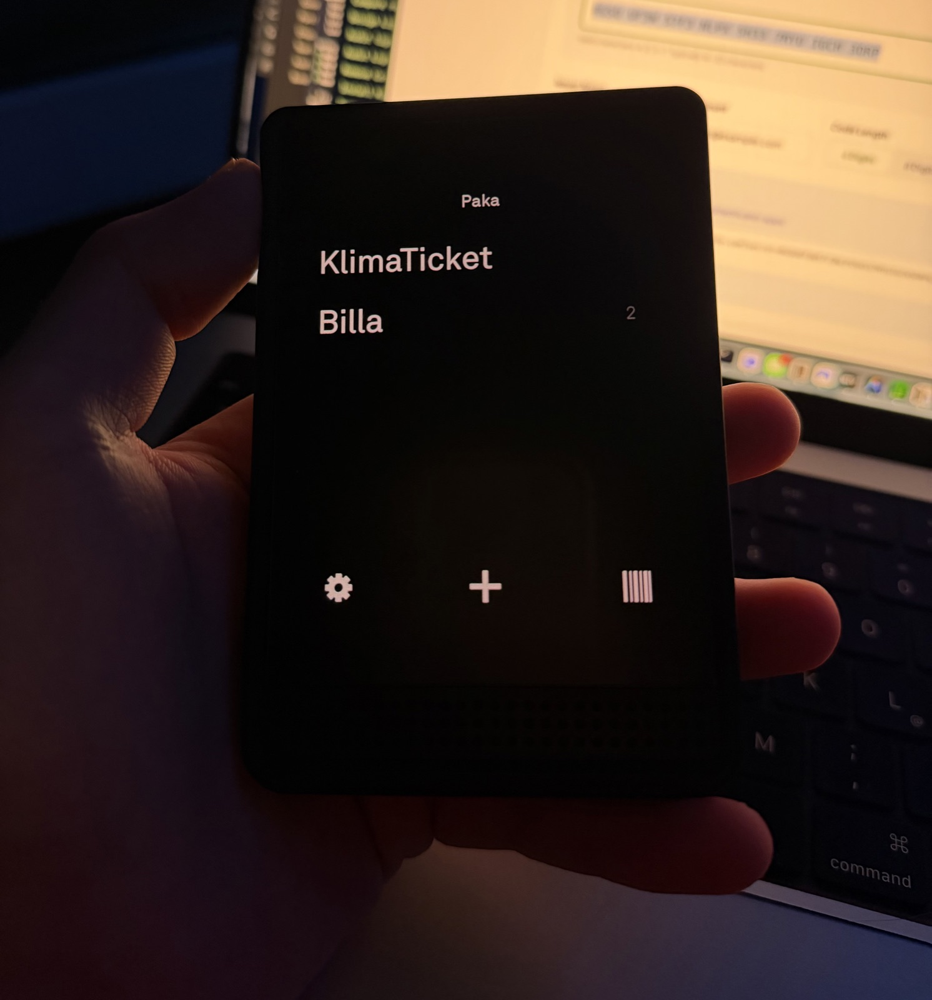
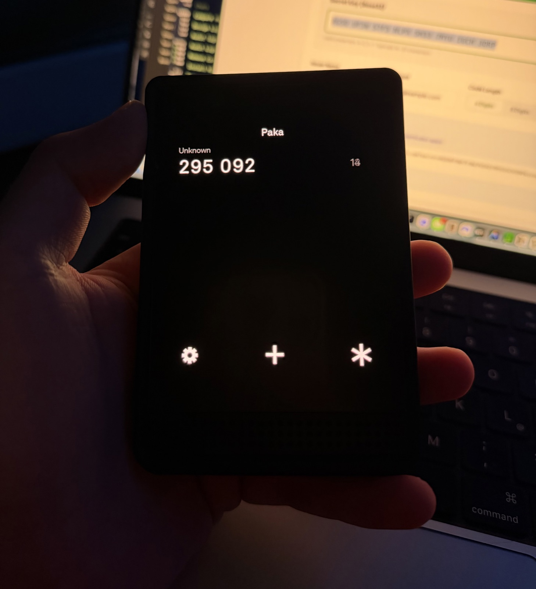
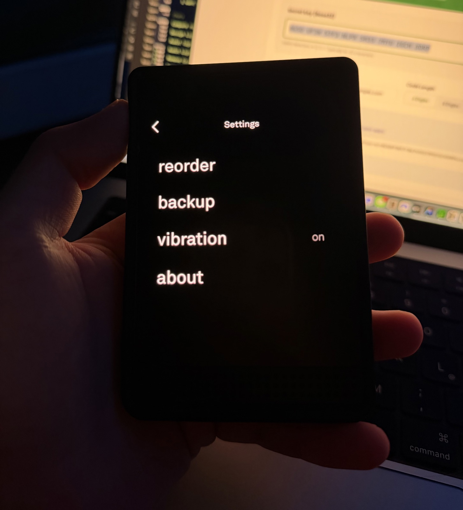
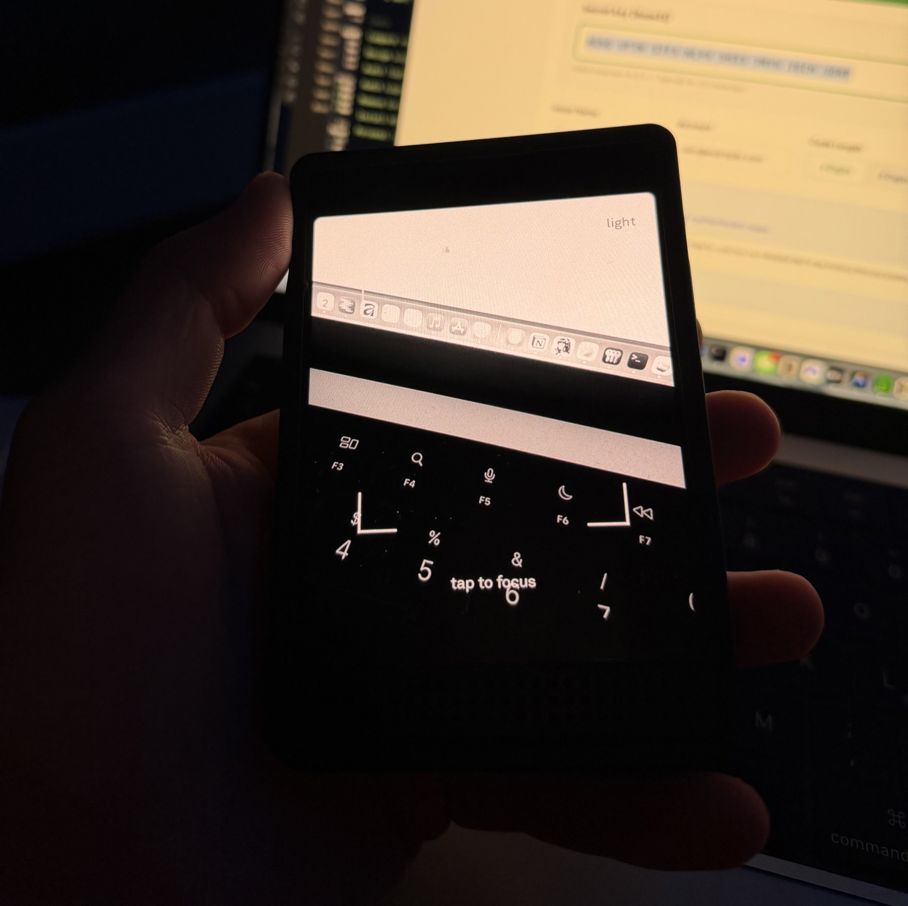

# Paka

Paka is an intentionally small, offline pass-and-authenticator tool designed for
Light Phone III. It scans and renders common barcode formats, carries encrypted
PDF passes, and generates TOTP codes without Google Play Services.

Current release: **0.13.0**

## Photos

<p align="center">
  
  
  
  
</p>

## Compatibility and independence

Paka is an independent, unofficial community tool designed for compatibility
with Light Phone III. It is not affiliated with, endorsed by, sponsored by, or
published by The Light Phone, Inc.

The names “Light Phone,” “Light Phone III,” “LightOS,” and related marks belong
to their respective owner and are used here only to describe compatibility.
Paka does not contain LightOS source code, Light branding, or proprietary Light
assets. Its original interface follows the public platform conventions and the
intentional design principles described by the LightOS Developer Program.

## Privacy

- Paka requests camera access only while scanning.
- Paka does not request internet access and contains no analytics or advertising.
- Pass data and TOTP secrets are encrypted with separate AES-256-GCM keys held
  by Android Keystore. Existing plaintext pass stores migrate automatically.
- Imported PDFs use their own Android Keystore key. Their encrypted copies are
  stored privately; viewing decrypts them into anonymous RAM through `memfd`,
  never a plaintext file. PDF passes require Android 11 or newer.
- Up to two optional file references in pass Details are external links. Paka stores only
  the link metadata in its encrypted pass database; the referenced file itself
  is not copied, encrypted, or included in Paka backups.
- Android cloud backup and device transfer are disabled.
- User-created portable backups are encrypted and authenticated offline with an
  AES-256-GCM key derived from the user's passphrase.
- TOTP codes copied to the clipboard are marked sensitive and cleared after 30 seconds while Paka has focus, or safely on the next return to Paka if the code is still present.

Uninstalling Paka permanently removes data that was not exported first. If an
Android Keystore key is invalidated, on-device encrypted data can only
be recovered from a user-created encrypted backup. Paka cannot recover a forgotten
backup passphrase.

## Interaction

Tap `+` to scan. Long-press `+` for intentional manual entry. Open a pass, then
long-press its displayed code to edit its name, stack, and notes. These
restrained secondary gestures are deliberate.
Lists show five entries at a time and snap vertically between full pages.
Vibration feedback can be enabled or disabled in settings. The scanner uses a
higher-resolution analysis stream, retries focus, detects sustained low light,
and can engage the camera light automatically. Rendered barcodes are decoded and
payload-checked before display; a bounded memory cache keeps common passes fast.
PDF pages open at a fitted overview, support pinch and instant double-tap zoom,
and rerender the settled viewport for sharp text without giant zoom bitmaps.
Paka returns to the pass list after leaving the app by default; the hidden
Developer screen can disable that behavior.
The same screen can enable an isolated demo mode with freshly generated,
in-memory passes and 2FA accounts; demo changes never touch the real stores.

## Building

The project requires JDK 17 and the Android SDK declared by `compileSdk` in the
app module. Release builds use the local `keystore.properties` configuration;
that ignored file and its referenced keystore must be backed up together because
future upgrades require the same signing identity.

```sh
./gradlew test lint assembleDebug assembleRelease
```

LightOS SDK integration should use the official Compose design library and
emulator when those developer-program dependencies are available.

## License

Copyright © 2026 Adrians Janovskis ([@janovsk1s](https://github.com/janovsk1s)).

Paka is licensed under [GPL-3.0-only](LICENSE), with the attribution and branding
terms in [ADDITIONAL_TERMS.md](ADDITIONAL_TERMS.md). Distributed modifications
must remain open source under GPLv3, disclose their corresponding source, retain
the required attribution, and identify themselves as modified.

See [NOTICE](NOTICE), [ACKNOWLEDGMENTS.md](ACKNOWLEDGMENTS.md), and
[THIRD_PARTY_NOTICES.md](THIRD_PARTY_NOTICES.md) for authorship, AI-assistance,
and dependency information.
